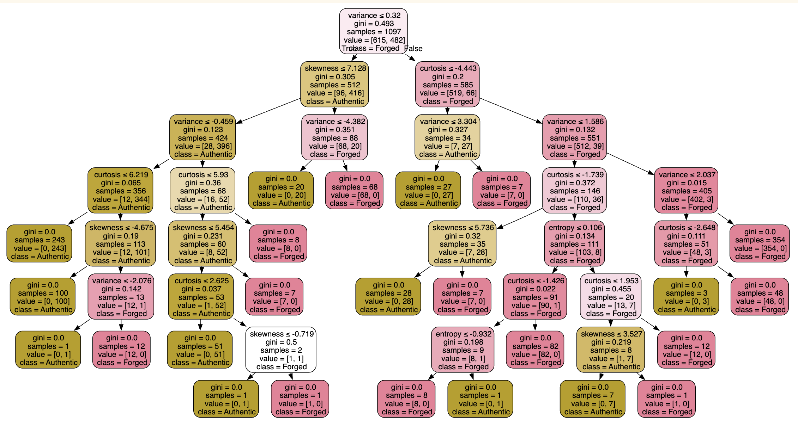

# 💸 Banknote Authentication Classification  
**Author:** Joanna Farris  
**Date:** November 12, 2025  

## Project Overview  
This project applies **machine learning classification techniques** to determine whether a banknote is **authentic or forged** using features extracted from scanned images.  

📄 **Project Files:**  
- 👉 [Midterm Notebook](notebook/midterm-farris.ipynb)  
- 👉 [Peer Review](peer_review.md)

The dataset used is the **UCI Banknote Authentication Dataset**, where each banknote image was transformed with a **wavelet transform**, and four statistical measures were computed:  
- **Variance**  
- **Skewness**  
- **Kurtosis**  
- **Entropy**

The goal of this analysis was to explore the data, visualize feature distributions, build predictive models, and compare their performance.

---

## Dataset Details  
- **Source:** UCI Machine Learning Repository  
- **Instances:** 1,372 banknotes  
- **Features:** 4 numeric features derived from wavelet-transformed images  
- **Target Variable:**  
  - `class` → 0 = forged, 1 = authentic  
- **Missing Values:** None (dataset is already clean)

---

## Data Preparation  
1. Loaded the dataset and verified structure, feature types, and missing values.  
2. Created histograms and boxplots for each feature to visualize distribution shape and potential outliers.  
3. Confirmed the target variable (`class`) is **balanced**, with nearly equal authentic and forged notes.  
4. Split the dataset into training and testing sets (80/20).  
5. Assigned the four numerical features to `X` and the target class to `y`.

---

## Exploratory Data Analysis  
- **Histograms** and **boxplots** showed that all four features vary meaningfully between authentic and forged notes.  
- **Skewness** and **kurtosis** in particular exhibit clear separation patterns between classes.  
- No anomalies or missing values were detected, and no preprocessing beyond visualization was required.  
- The balanced target distribution supports strong model training without adjustments.  
  
### Histograms

 

### Boxen Plots


---

## Modeling and Evaluation  
Two classification models were implemented and compared:

| Model | Accuracy | Key Notes |
|-------|:--------:|-----------|
| **Logistic Regression** | 100% | Performs extremely well due to highly separable numeric features |
| **Decision Tree** | 99% | Also performs well; easy to interpret and visualize |

**Evaluation Metrics Used:**  
- Accuracy  
- Precision  
- Recall  
- F1-Score  
- Confusion Matrix  
- Classification Reports (train and test)

### Decision Tree Visualization  
A fully customized, color-coded decision tree was created for interpretability:



---

## Key Findings  
- The dataset is **nearly linearly separable**, which is ideal for Logistic Regression.  
- All four features contribute meaningful information — no single feature dominates on its own.  
- Logistic Regression achieved **perfect generalization** on the test set.  
- The Decision Tree correctly modeled most cases but was slightly less stable than the linear model.

---

## Tools and Libraries  
- Python  
- pandas, numpy  
- matplotlib, seaborn  
- scikit-learn (LogisticRegression, DecisionTreeClassifier, metrics)  
- graphviz (for custom tree visualization)

---

## Reflections  
- **Challenges:**  
  - Understanding how wavelet-transformed images lead to statistical features  
  - Interpreting kurtosis and skewness in the context of real classification  
  - Tweaking visualizations and customizing the decision tree formatting  

- **Insights:**  
  - Even a small number of well-engineered features can completely separate two classes  
  - Simple models can outperform more complex ones when the data is clean and structured  
  - Visualizations (histograms, boxplots, and trees) added clarity to the decision-making process  

- **Next Steps:**  
  - Try Support Vector Machines or Random Forest for comparison  
  - Explore scaling and PCA even though this dataset doesn’t require it  
  - Investigate feature importance scores and decision boundaries

---

## Conclusion  
This project demonstrates the complete classification workflow — from exploration and visualization to modeling and evaluation.  

The outstanding performance of both models shows how effective statistical features from wavelet-transformed images can be for detecting counterfeit banknotes.  

Logistic Regression emerged as the best model due to its perfect accuracy and ability to generalize cleanly from limited features.

---

## Model Summary

| Model Type            | Features Used                          | Accuracy | Precision | Recall | F1-Score | Notes |
|----------------------|-----------------------------------------|:--------:|:--------:|:------:|:--------:|-------|
| Logistic Regression  | variance, skewness, kurtosis, entropy  | 1.00     | 1.00     | 1.00   | 1.00     | Simple, stable, and ideal for linearly separable data |
| Decision Tree        | variance, skewness, kurtosis, entropy  | 0.99     | 0.99     | 0.99   | 0.99     | Interpretable; performs nearly as well as logistic regression |

---

## Setup Virtual Environment

```bash
uv venv
uv python pin 3.12
uv sync --extra dev --extra docs --upgrade
source .venv/bin/activate   # (Mac)
uv add --dev pre-commit ruff
uv run python --version
